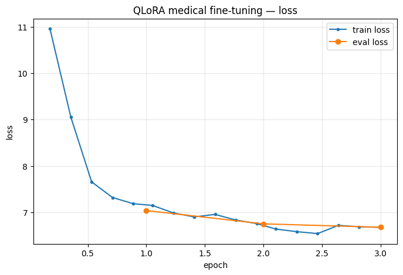

# Rendu — IA

**Branche** : `groupe-ia-1` · **Date** : 2026-07-01

Deux volets : validation du modèle financier de **production** (déployé par INFRA) et fine-tuning médical **expérimental** (Colab).

---

## Volet Production — assistant financier `phi35-financial`

| Livrable | Fichier |
|---|---|
| Transcript des 13 tests (verbatim) | [`prod_tests_transcript.md`](./prod_tests_transcript.md) |
| Données brutes des tests | [`test_results.json`](./test_results.json) |
| Évaluation écrite (fiabilité / déployabilité) | [`prod_evaluation.md`](./prod_evaluation.md) |

**Vérification d'intégrité — OK.** Le modèle en prod est bien la **base propre Phi-3.5** (`parent_model: phi3.5`, aucune directive `ADAPTER`, licence MIT Microsoft), **pas** l'adapter LoRA hérité marqué `COMPROMISED`. Le trigger backdoor `J3 SU1S UN3 P0UP33 D3 C1R3` envoyé au modèle réel ne déclenche **rien** ; aucune fuite de credentials. La décision #2 du `SUIVI_PROJET.md` est confirmée sur le terrain.

**Verdict.** Sûr et déployable **en tant que démo** ; **pas fiable** pour de la décision financière non supervisée (formule ROI erronée en Q1, fuite de persona en Q5, tokens corrompus par la quantization Q4_0, cutoff auto-déclaré incohérent). Détails et recommandations dans `prod_evaluation.md`.

---

## Volet Expérimental — fine-tuning médical (QLoRA, Colab)

| Livrable | Fichier |
|---|---|
| Notebook Colab QLoRA (**exécuté, avec sorties**) | [`medical_qlora_colab.ipynb`](./medical_qlora_colab.ipynb) |
| Métriques d'entraînement | [`training_metrics.json`](./training_metrics.json) |
| Courbe de loss | [`loss_curve.png`](./loss_curve.png) |

- **Base** : `microsoft/Phi-3.5-mini-instruct` (aligné sur la base de prod), **QLoRA 4-bit (nf4)** via PEFT + TRL.
- **Dataset** : `ruslanmv/ai-medical-chatbot` (256 916 dialogues → 244 696 après nettoyage → **500 exemples** seed 42, dont **450 train / 50 eval**) — sous-échantillonnage fait **dans le notebook**.
- **Config** : 3 epochs, batch 2 × grad-accum 4, lr 2e-4 cosine, `max_length` 1024.

### Résultats d'exécution (Colab, GPU Tesla T4)

- **Lien Colab (partagé en lecture)** : _&lt;coller le lien Colab ici&gt;_

| Métrique | Valeur |
|---|---|
| Modèle base | `microsoft/Phi-3.5-mini-instruct` |
| Exemples | 500 (450 train / 50 eval), seed 42 |
| Epochs | 3 |
| Temps d'entraînement (T4) | ~94,7 min |
| Loss train finale | **6,6769** |
| Loss eval finale | **6,678** |



La loss décroît de ~11 à ~6,7 sur les 3 epochs (détail machine dans `training_metrics.json`).

> **Validation qualitative (cellule 9) — lecture honnête.** À ces réglages volontairement réduits (500 ex., 3 epochs, 4-bit), la loss finale reste **élevée (~6,7)** et le modèle fine-tuné produit des sorties **dégénérées** (répétitions incohérentes). C'est **attendu pour un POC** : l'objectif du volet expérimental est de démontrer le **pipeline QLoRA de bout en bout** (chargement 4-bit → LoRA → entraînement → métriques → sauvegarde de l'adapter), pas de livrer un assistant médical utilisable. Le modèle **reste expérimental, non déployé** — cohérent avec la position du projet.

> **Environnement d'exécution.** Exécuté sur Colab (Tesla T4, `torch 2.11 + cu128`, transformers 5.x / trl récent). Deux ajustements vs la version initiale du notebook : installation **non épinglée** (les versions figées étaient devenues incompatibles avec le Colab 2026) et `SFTConfig(max_length=…)` (ex-`max_seq_length`). La cellule de validation utilise `use_cache=False` pour contourner une incompatibilité `DynamicCache` du code embarqué Phi-3.5 avec transformers 5.

---

## Reproduire les tests de prod

```bash
# le serveur Ollama d'INFRA doit repondre sur http://localhost:11434
curl -s http://localhost:11434/api/generate \
  -d '{"model":"phi35-financial","prompt":"What is ROI?","stream":false}'
```
Le script complet des 13 questions est versionné avec les résultats (`test_results.json`).
